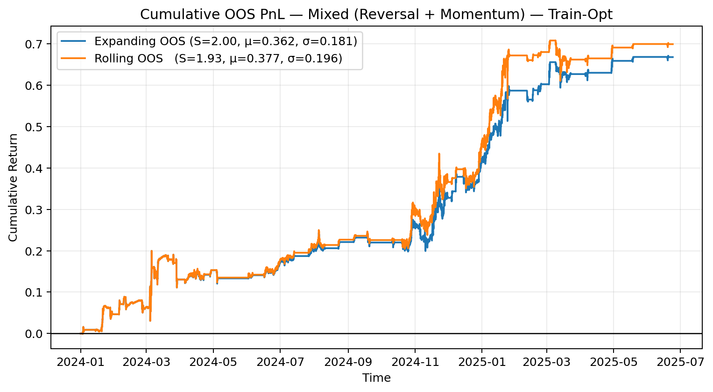
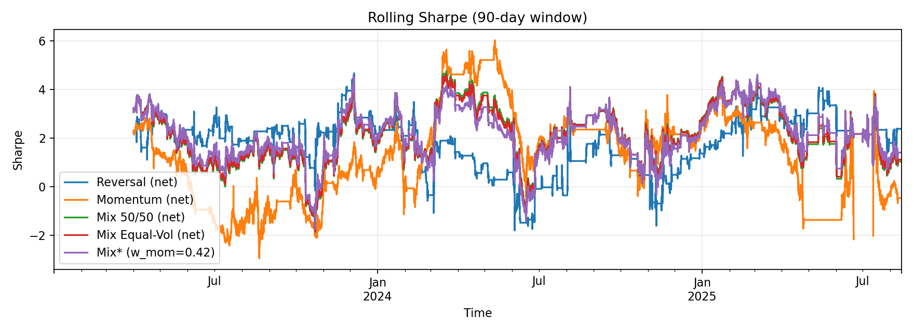
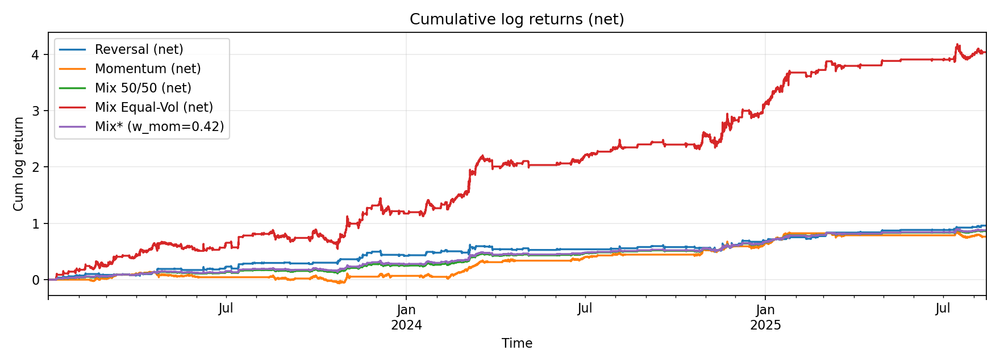

# Crypto Statistical Arbitrage

A reproducible research framework for **statistical arbitrage in crypto**, demonstrating the full quant workflow: **data acquisition**, **signal design**, **backtesting**, **robustness tests**, **walk-forward validation**, and **portfolio construction**.  

The project is designed to highlight **research rigor**, **trading relevance**, and **reproducibility**, making it suitable for both a quant portfolio and professional applications.

---

## At a Glance

This project evaluates cross-sectional **reversal** and **momentum** strategies in cryptocurrencies and combines them into diversified mixed sleeves.  
The table below highlights the key performance metrics (net of costs), showing how each sleeve performs on its own and how they behave when combined.

| Strategy              | Net Sharpe | Ann. Return | Ann. Vol | Turnover/yr | Cost_py | Notes |
|-----------------------|-----------:|------------:|---------:|------------:|--------:|-------|
| **Reversal**          | **1.77**   | 0.366       | 0.207    | ~89         | ~0.062  | Short lookback (k=2–4), daily rebalance, strong banding |
| **Momentum**          | **1.32**   | 0.291       | 0.222    | ~18         | ~0.013  | Long lookback (k≈336–500), slow rebalancing, low cost |
| **Mixed (50/50)**     | **2.18**   | 0.329       | 0.151    | –           | –       | Simple diversified blend |
| **Mixed (Static Opt.)** | **2.21** | 0.335       | 0.151    | –           | –       | ~42% momentum weight; best in-sample risk-adjusted |
| **Mixed (Equal-Vol)** | **2.52**   | 0.401       | 0.159    | –           | –       | **Best OOS performer**; cost-resilient (Sharpe ≈ 2.1 at 20bps) |

---

## Repo Structure

crypto-stat-arb/  
│── notebooks/ # Analysis & results walkthroughs  
│── src/ # Core research code   
│ ├── signals # Reversal & momentum signal construction  
│ ├── backtest # Portfolio construction & simulation  
│ ├── etc.  
│── data/ # Example price/return datasets  
│── README.md # This file  

---

## Data & Setup

- **Universe:** 12 liquid crypto pairs (hourly bars).  
- **Sample:** ~2.6 years (≈ 12,960 hourly obs for walk-forward).  
- **Costs:** baseline **7 bps** per rebalance unless otherwise noted.  
- **Benchmark:** BTCUSDT for residualization and alpha estimates.

---

# Results

## Cross-Sectional Reversal

- **Best configuration:**  
  `k=4` (4-bar lookback), `band=2.5`, `beta_win=168` (≈1 week residualization),  
  `every=24` (daily rebalance), `vol_win=24`.  
- **Performance:**  
  - Net Sharpe ≈ **1.77** (gross ≈ 2.07)  
  - Ann. return ≈ 0.366 | Ann. vol ≈ 0.207  
  - Turnover ≈ 89/yr | Cost drag ≈ 0.06  

**Observations**
- Multiple nearby configs (Sharpe 1.66–1.73) confirm robustness.  
- Short-to-medium lookbacks (k=2–4), strong banding (2.0–2.5), and daily rebalancing are consistently effective.  
- Higher turnover specs (e.g., every=36) show strong test Sharpe but lose efficiency due to costs.  
- Lower turnover specs (every=48) are cheaper but underperform.  

**Conclusion:** Reversal works best with **short horizons, strong banding, and daily rebalancing**, producing robust out-of-sample Sharpe even with transaction costs up to 20 bps.

---

## Cross-Sectional Momentum

- **Best configurations:**  
  - **Slow sleeve:** `k ≈ 168` (≈7 days), `band=2.5`, `every=720` (≈30 days) → Net Sharpe ≈ 1.31, turnover ≈ 3/yr.  
  - **Expanded grid optimum:** `k ≈ 500` (≈21 days), `band=2.0`, `every=336` (≈14 days) → Net Sharpe ≈ 1.32, turnover ≈ 18/yr.  

**Performance**
- Net Sharpe ≈ **1.3** across best runs.  
- Annualized returns ≈ 0.29, volatility ≈ 0.22.  
- Extremely low turnover in slow variants; costs negligible.  
- Robustness tests show parameter stability around long horizons (`k=336–500`) with infrequent rebalancing (`every=336–720`).  

**Conclusion:** Momentum is a **low-turnover, cost-resilient sleeve** that performs best with long horizons and slow rebalancing. It generates **statistically significant alpha vs BTC** with minimal beta exposure.

---

## Mixed Strategy (Reversal + Momentum)

- **Single-sleeve (net):**  
  - Reversal: Sharpe 1.77 | Ann. ret 0.366 | Vol 0.207 | Turnover ~89/yr  
  - Momentum: Sharpe 1.32 | Ann. ret 0.291 | Vol 0.222 | Turnover ~18/yr  
- **Correlation:** ≈ 0 (−0.008) → strong diversification benefit.  

**Mixed portfolios (net):**
- **50/50:** Sharpe **2.18**, Ann. ret 0.329, Vol 0.151  
- **Static optimizer (w_mom ≈ 0.42):** Sharpe **2.21**, Ann. ret 0.335, Vol 0.151  
- **Equal-Vol (risk parity):** **Best OOS results** — Sharpe ≈ **2.5**, Ann. ret ≈ 0.40, Vol ≈ 0.16  

**Walk-forward OOS (Equal-Vol):**  
- Expanding: Sharpe **2.52**, Ann. ret 0.401, Vol 0.159  
- Rolling:   Sharpe **2.52**, Ann. ret 0.406, Vol 0.161  
- Cost resilience: Sharpe remains ≈ **2.4** at 10 bps and ≈ **2.1** at 20 bps  

**Alpha vs BTC (Equal-Vol):**  
- Ann. alpha ≈ 0.42, **t-stat > 3.5** → statistically significant  
- Beta ≈ −0.02 (small, negative)  
- R² < 1% → returns are largely independent of BTC  

**Robustness check (Train-Opt):**  
- Train-optimized mixes delivered Sharpe ≈ **2.0** OOS with similar alpha, confirming robustness across portfolio construction methods  

---

## Figures

Key plots (in `figs/`):

-   
-   
-   
-  *(optional overview)*  

---

## Limitations

- **Sample length:** Only ~2.6 years of hourly data — limited regime coverage.  
- **Universe scope:** 12 assets; current results based on 12 liquid pairs; expanding to 20–30+ assets could further improve robustness and cross-sectional signal strength.    
- **Cost model:** Simplified constant transaction cost assumption; real-world frictions (slippage, fees, market impact) may be larger and exchange-specific.  
- **Parameter dependence:** While robustness checks are strong, performance still depends on grid choices (lookbacks, banding, residualization).  
- **Benchmark choice:** Residualization is done vs BTC; alternative benchmarks (ETH, alt baskets, stablecoin pairs) may shift outcomes.  
- **Execution feasibility:** Turnover estimates assume perfect liquidity; smaller alts may face practical liquidity constraints.  

---

## Overall Takeaways

- **Reversal**: high-frequency edge, best with short horizons, banding, and daily rebalance  
- **Momentum**: slow-moving, low-turnover, highly cost-resilient with long horizons  
- **Equal-Vol mix**: delivers the **strongest OOS results** — ~**2.5 Sharpe**, significant alpha vs BTC, robust to trading costs up to 20 bps  
- **Train-Opt**: slightly lower (~2.0 Sharpe) but consistent, reinforcing robustness  

Together, reversal and momentum form a **diversified, market-neutral strategy** that generates **statistically significant alpha** with minimal beta and cost drag.  